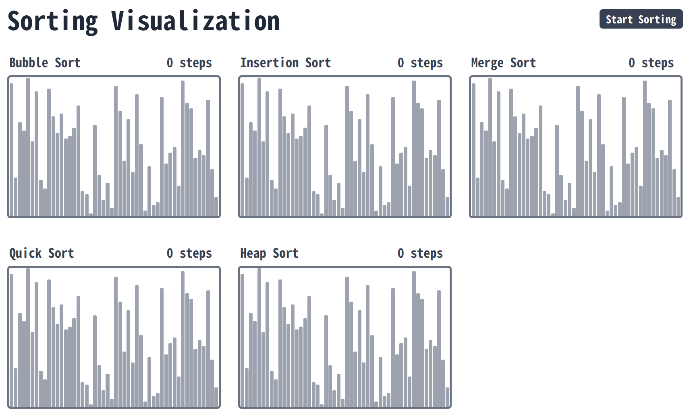
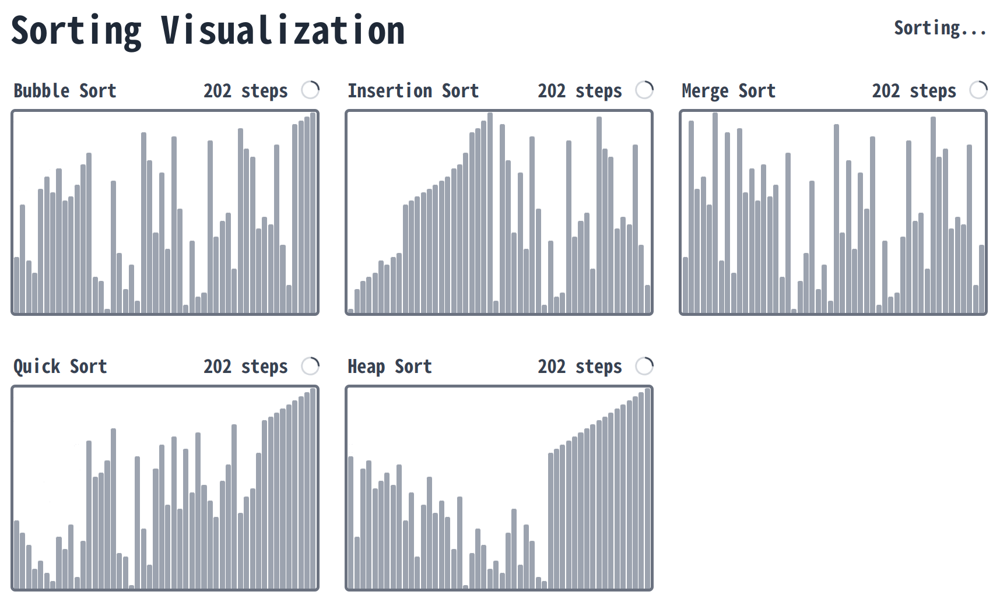

# Sorting Visualization

> There is a preview on [sorting.squidspirit.com](https://sorting.squidspirit.com), which is set up with GitHub Pages.

## Description

A visualization of several sorting methods. The followings are the sorting methods supported currently.

- Bubble Sort

- Insertion Sort

- Merge Sort

- Quick Sort

- Heap Sort

## Usage

### First Look

- Ckicking the button top-right will start the sorting.

- The height of the strips represents the value for the array to be sorted, which is seperated from 1 to 50 randomly by default.

### Sorting

- A step means a comperation or swapping operation.

- Every step costs 10 ms by default.

### Query Parameters

- `quantity`: The quantity of the strips. Default value is 50.

- `interval`: The interval time between steps in millisecond. Default value is 10.

For example, if you want to set the interval as 100, you can adjust the url as [sorting.squidspirit.com/?**interval=100**](https://sorting.squidspirit.com/?interval=100); if you want to set the interval as 5 and the quantity as 150, the url should be set as [sorting.squidspirit.com/?**interval=5**&**quantity=150**](https://sorting.squidspirit.com/?interval=5&quantity=150)

## Development

- Framework: Next.js.

- Run `yarn install` to install the dependencies.

- Run `yarn run dev` to set up a development server at [localhost:3000](http://localhost:3000).
